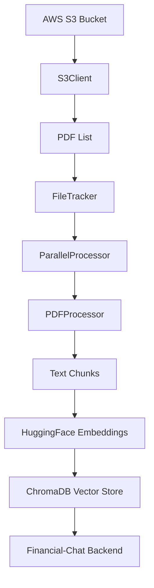

# 🤖 Financial-ML

> Sistema modular de procesamiento e ingestión de documentos PDF para análisis financiero con IA

**Financial-ML** es el componente de procesamiento de datos del ecosistema [Financial-Chat](../), especializado en la ingestión masiva de documentos PDF desde AWS S3 y su transformación en una base vectorial optimizada para consultas con IA.

## 📋 Tabla de Contenidos

- [🎯 Propósito](#-propósito)
- [🏗️ Arquitectura](#️-arquitectura)
- [⚡ Características](#-características)
- [🛠️ Instalación](#️-instalación)
- [⚙️ Configuración](#️-configuración)
- [🚀 Uso](#-uso)
- [📊 Monitoreo](#-monitoreo)
- [🔧 Desarrollo](#-desarrollo)
- [📝 Logs y Debugging](#-logs-y-debugging)
- [🤝 Contribución](#-contribución)

---

## 🎯 Propósito

Este sistema está diseñado para:

- **📥 Ingestar** documentos PDF masivos desde AWS S3
- **✂️ Fragmentar** documentos en chunks optimizados para IA
- **🔍 Crear embeddings** usando modelos de HuggingFace
- **💾 Almacenar** en base vectorial ChromaDB para consultas rápidas
- **📊 Monitorear** el proceso con estadísticas detalladas
- **🔄 Procesar** de forma paralela y resiliente

## 🏗️ Arquitectura

```
financial-ml/
├── 📁 ingestion/              # Sistema modular de ingestión
│   ├── 🔧 config.py           # Configuración centralizada
│   ├── ☁️ s3_client.py        # Cliente AWS S3 con reintentos
│   ├── 📄 pdf_processor.py    # Procesamiento de PDFs
│   ├── 📝 file_tracker.py     # Seguimiento de archivos
│   ├── ⚡ parallel_processor.py # Procesamiento paralelo
│   ├── 💾 vector_store_manager.py # Gestión ChromaDB
│   ├── 🚀 process_s3_documents.py # Pipeline principal
│   └── 🛠️ utils.py           # Utilidades auxiliares
├── 📁 vector-store/          # Base vectorial ChromaDB
└── 📁 scripts/              # Herramientas de diagnóstico
    └── 🩺 diagnose_resources.py # Análisis de configuración
```

### 🔄 Flujo de Procesamiento



## ⚡ Características

### 🚀 **Procesamiento Optimizado**
- ✅ Procesamiento paralelo configurable
- ✅ Reintentos automáticos para fallos de red
- ✅ Timeouts adaptativos según tamaño de archivo
- ✅ Procesamiento por lotes para optimizar memoria

### 📊 **Monitoreo Avanzado**
- ✅ Logs estructurados con diferentes niveles
- ✅ Estadísticas en tiempo real
- ✅ Seguimiento de archivos procesados
- ✅ Detección de archivos problemáticos

### 🔧 **Configuración Flexible**
- ✅ Variables de entorno para toda la configuración
- ✅ Configuración adaptativa de recursos
- ✅ Parámetros de chunking personalizables
- ✅ Modelos de embeddings intercambiables

### 🛡️ **Robustez**
- ✅ Manejo resiliente de errores
- ✅ Recovery automático de fallos temporales
- ✅ Validación de integridad de datos
- ✅ Limpieza automática de recursos

---

## 🛠️ Instalación

### Prerrequisitos
- Python 3.8+
- Acceso a AWS S3
- Credenciales AWS configuradas

### 1. Instalar dependencias
```bash
cd financial-ml
pip install -r requirements.txt
```

### 2. Configurar AWS
```bash
# Opción 1: AWS CLI
aws configure

# Opción 2: Variables de entorno
export AWS_ACCESS_KEY_ID="tu-key"
export AWS_SECRET_ACCESS_KEY="tu-secret"
export AWS_DEFAULT_REGION="us-east-1"
```

---

## ⚙️ Configuración

### 🩺 Diagnóstico Automático de Configuración

**¡IMPORTANTE!** Antes de configurar el sistema, ejecuta la herramienta de diagnóstico para obtener recomendaciones personalizadas:

```bash
cd scripts
python diagnose_resources.py
```

Este script analizará tu sistema y te proporcionará:
- 🔍 **Análisis de recursos** disponibles (CPU, RAM, almacenamiento)
- 💡 **Recomendaciones optimizadas** de configuración
- ⚙️ **Variables de entorno** sugeridas
- 📊 **Estimaciones de rendimiento** esperado

### 📝 Configuración Manual

Crear archivo `.env` en la carpeta `ingestion/`:

```bash
# === CONFIGURACIÓN AWS ===
AWS_BUCKET_NAME=mi-bucket-pdfs
AWS_DEFAULT_REGION=us-east-1
PREFIX=documentos/financieros/

# === CONFIGURACIÓN DE PROCESAMIENTO ===
# (Usar valores recomendados por diagnose_resources.py)
WORKERS=4                    # Hilos de procesamiento paralelo
BATCH_SIZE=10               # PDFs por lote
CHUNK_SIZE=1000             # Tamaño de fragmentos de texto
CHUNK_OVERLAP=200           # Superposición entre fragmentos

# === CONFIGURACIÓN AVANZADA ===
MAX_FILE_SIZE=52428800      # 50MB límite por archivo
MIN_FILE_SIZE=1024          # 1KB mínimo
MAX_RETRIES=3               # Reintentos por descarga
```

### 🎯 Guía de Configuración por Caso de Uso

| Caso de Uso | WORKERS | BATCH_SIZE | CHUNK_SIZE | Observaciones |
|-------------|---------|------------|------------|---------------|
| 🔬 **Desarrollo/Testing** | 2 | 5 | 800 | Recursos mínimos |
| 🏢 **Producción Pequeña** | 4 | 10 | 1000 | Configuración balanceada |
| 🚀 **Producción Grande** | 8 | 20 | 1200 | Máximo rendimiento |
| 💾 **RAM Limitada** | 2 | 5 | 600 | Conservar memoria |

---

## 🚀 Uso

### Ejecución Básica
```bash
cd financial-ml/ingestion
python process_s3_documents.py
```

### Ejecución con Configuración Personalizada
```bash
# Configuración temporal
WORKERS=8 BATCH_SIZE=15 python process_s3_documents.py

# Con logging detallado
LOG_LEVEL=DEBUG python process_s3_documents.py
```

### 📊 Salida Esperada
```
🚀 Iniciando proceso de ingestión desde S3...
🔍 Obteniendo lista de PDFs desde S3...
📊 Resumen: 1,250 objetos, 987 PDFs válidos
📋 Total PDFs: 987, Ya procesados: 123, Por procesar: 864

🔄 Procesando lote 1/87
📦 PDFs en este lote: 10
⌛ [documento1.pdf] Descargando (2.3MB) con timeout 32s...
✅ [documento1.pdf] 15 fragmentos generados

📊 Progreso: 100/864 (11.6%) - Velocidad: 12.5 PDFs/min - ETA: 61.1 min

✅ PROCESO FINALIZADO
📊 Resumen final:
  - PDFs procesados exitosamente: 864
  - Fragmentos generados: 12,847
  - Tiempo total: 68.2 minutos
  - Velocidad promedio: 12.7 PDFs/min
💾 Documentos en base vectorial: 12,847
```

---

## 📊 Monitoreo

### 📋 Archivos de Seguimiento

El sistema genera automáticamente varios archivos de monitoreo:

```bash
📁 ingestion/
├── 📊 pdf_processing.log        # Log principal con todos los eventos
├── 📝 processed_pdfs.txt        # Lista de PDFs procesados exitosamente
└── ⚠️ problematic_files.txt     # PDFs que causaron errores
```

### 🔍 Análisis de Logs

```bash
# Ver progreso en tiempo real
tail -f ingestion/pdf_processing.log

# Filtrar solo errores
grep "ERROR\|CRITICAL" ingestion/pdf_processing.log

# Contar PDFs procesados
wc -l ingestion/processed_pdfs.txt

# Ver archivos problemáticos
cat ingestion/problematic_files.txt
```

### 📈 Métricas Importantes

| Métrica | Descripción | Archivo |
|---------|-------------|---------|
| **PDFs Procesados** | Documentos convertidos exitosamente | `processed_pdfs.txt` |
| **Fragmentos Generados** | Chunks de texto creados | Log principal |
| **Archivos Problemáticos** | PDFs que fallaron | `problematic_files.txt` |
| **Velocidad de Procesamiento** | PDFs/minuto promedio | Log principal |
| **Tasa de Errores** | % de fallos sobre total | Log principal |

---

## 🔧 Desarrollo

### 🧪 Testing Individual de Componentes

```python
# Probar solo el cliente S3
from ingestion.s3_client import S3Client
s3 = S3Client()
pdfs = s3.get_pdf_keys("test/")

# Probar solo el procesador PDF
from ingestion.pdf_processor import PDFProcessor
processor = PDFProcessor()
docs, error = processor.process_pdf_content(data, "test.pdf")

# Probar solo la base vectorial
from ingestion.vector_store_manager import VectorStoreManager
vm = VectorStoreManager()
vm.save_documents(docs)
```

### 🔄 Extensión del Sistema

Para agregar nuevas funcionalidades:

1. **Nuevo tipo de documento**: Extender `PDFProcessor`
2. **Nueva fuente de datos**: Crear cliente similar a `S3Client`
3. **Nuevo modelo de embeddings**: Modificar `VectorStoreManager`
4. **Nueva base vectorial**: Implementar interfaz en `VectorStoreManager`

### 🐛 Debugging Común

| Problema | Posible Causa | Solución |
|----------|---------------|----------|
| `TimeoutError` | Archivos muy grandes | Aumentar `MAX_FILE_SIZE` o reducir `BATCH_SIZE` |
| `MemoryError` | Muchos workers/lotes grandes | Reducir `WORKERS` y `BATCH_SIZE` |
| `S3 Access Denied` | Credenciales incorrectas | Verificar AWS credentials |
| `ChromaDB Error` | Falta espacio en disco | Limpiar `vector-store/` |

---

## 📝 Logs y Debugging

### 🎚️ Niveles de Logging

```bash
# Logging mínimo (solo errores críticos)
LOG_LEVEL=CRITICAL python process_s3_documents.py

# Logging normal (recomendado)
LOG_LEVEL=INFO python process_s3_documents.py

# Logging detallado (debugging)
LOG_LEVEL=DEBUG python process_s3_documents.py
```

### 🔍 Análisis de Errores Comunes

**Error de memoria:**
```
CRITICAL: 💥 Error crítico: Out of memory
```
**Solución:** Reducir `WORKERS` y `BATCH_SIZE` en `.env`

**Error de conexión S3:**
```
ERROR: ❌ Error al obtener objetos de S3: Access Denied
```
**Solución:** Verificar credenciales AWS y permisos del bucket

**Error de ChromaDB:**
```
ERROR: ❌ Error guardando documentos: disk full
```
**Solución:** Limpiar espacio en disco o cambiar `VECTOR_DIR`

---

## 🤝 Contribución

Este módulo es parte del ecosistema **Financial-Chat**. Para contribuir:

1. 🍴 Fork del repositorio principal
2. 🌿 Crear rama feature: `git checkout -b feature/nueva-funcionalidad`
3. 💾 Commit cambios: `git commit -am 'Agregar nueva funcionalidad'`
4. 📤 Push: `git push origin feature/nueva-funcionalidad`
5. 🔄 Crear Pull Request

### 📋 Checklist para PRs

- [ ] ✅ Tests unitarios agregados
- [ ] 📝 Documentación actualizada
- [ ] 🎨 Código formateado con black/flake8
- [ ] 📊 Logs informativos agregados
- [ ] ⚙️ Configuración actualizada si necesario

---